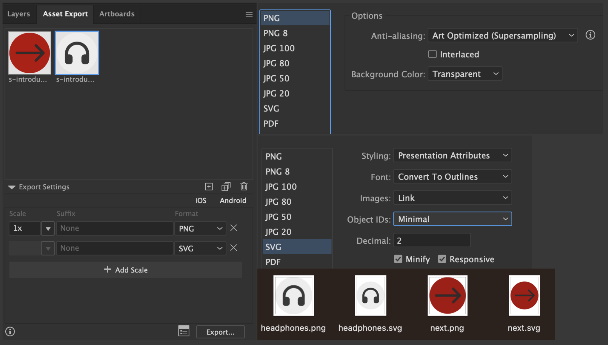
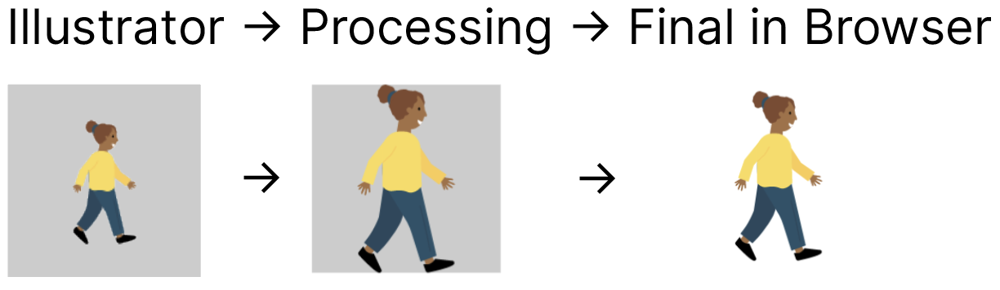

# matt

> Moral Attitudes Study

---

## Development

todo

### URL Parameters

You can modify the experiment by attaching various URL parameters, for example:  
https://ccp-odc.eva.mpg.de/matt/?id=12345&culture=DE_urban&webcam=true&adult=true

Culture parameters are composed of a country Code (i.e, ISO 3166-1 alpha-2 (e.g., DE)) and a suffix (i.e., rural or urban)

- `id` (subject id)
- `culture` (e.g., this loads slides, sounds, and texts)
- `webcam` (record entire experiment with user webcam)
- `adult` (if true, there is no audio input required, but text must be written)

### ❡ Adding Text

1. Create a new rectangle in Illustrator. Its size defines the bounding box of the text. Give this rectangle a name prefixed with text- (e.g., `text-objectChoiceRandom`). Use camelCase, avoid numbers.
2. Add a new key to all translation files within `src/populations/xx-xx/translation.ts`. Use the identical id as defined prior in Illustrator, yet, without the prefix (e.g., `objectChoiceRandom`).  
   The **value** should be a valid HTML text node (usually, you will use `<p>`, or `<h1>`, `<h2>`, etc.). For example:

```javascript
export const translation = {
	objectChoiceRandom: '<p>Select a single arbitrary object!</p>',
	objectChoiceMultiple: '<p>Select multiple objects!</p>',
};
```

3. The text will automatically appear at the defined location of your rectangle.

### ♲ Recycle/Reuse Objects

If you use an SVG object more than once, and your object is a more complex shape (involving `path`), you may opt-in to use object recycling following this steps:

1. Identify the object(s) you want to reuse in your composition, and follow the next steps:
2. **(Optional)** Configure Asset Export Settings:

|     |
| :------------------------------------: |
| _Asset Export Settings in Illustrator_ |

3. Export your target object as SVG (this will be your **link**ed reference) and PNG (this will be your **p**lace**h**older for target location and size. Put those two files into `/assets/` directory.
4. Uniquely rename both files (e.g., `child.svg` and `child.png`, respectively)
5. Within Illustrator, create squares (make sure they are squares with the same width/height) having your desired target size and location within your composition (you can add a fill to make them visible, avoid strokes). Use the shapes you exported as a tempalte for location and width/height.
6. Provide a unique id for the **p**lace**h**older square. **Prefix the id with `ph-`**. For example `ph-child`.
7. Since you created your placeholder squares, you can delete the prior exported SVG object from your SVG composition.
8. Drag and drop the PNG(!) file into Illustrator (this will automatically be a linked file).  
   _Note_: You don’t need to place the PNG file in your square or resize it to match its bounding box. It can be at any location in your composition. **Only the placeholder rectangle defines your target location and size**:

|          |
| :--------------------------------------------------------------: |
| _No need to adjust the png file to match the bounding box size!_ |

9. Provide a unique id for the linked PNG file. **Prefix the id with `link-`**. For example: `link-child`.  
   _Note_: The ids for the placeholder square and linked PNG should be identical apart from their prefix (`ph-child` & `link-child`).
10. If you re-use an object multiple times, incorporate other naming strategies to guarantee naming uniqueness (e.g., `link-slide2-child` and `ph-slide2-child` respectively). Or, if you use the same object multiple times on the same slide/layer, start numerating it (e.g., `link-slide2-child1`, `link-slide2-child2`, and `ph-slide2-child1`, `ph-slide2-child2`, respectively)
11. Profit

For further (implementation) details, see this issue: [#53](https://github.com/ccp-eva/matt/issues/53).
